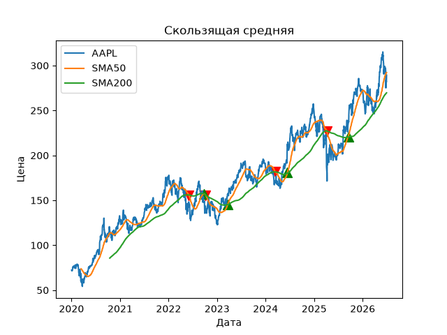
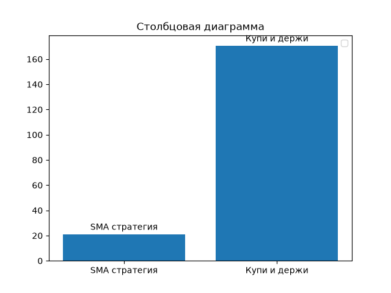

# SMA Crossover Backtest — AAPL

## Описание
В этом проекте проверяется прибыльность стратегии скользящей средней на историческом промежутке.

## Стратегия
Стратегия скользящего среднего (SMA) работает по принципу пересечения короткой средней длинной средней. При пересечении сверху вниз это сигнал продажи. При пересечении снизу вверх это сигнал к покупке. Обосновывается это историческим началом тренда роста или падения.

## Результаты
SMA стратегия: ~20%
Buy & Hold: ~170%
Период: 2020–2026

Линейная диаграмма:

Столбчатая:

## Выводы
по результатам анализа стратегии скользящего среднего в диапазоне 50 и 200 дней. За этот период было совершено 8 сделок (4 покупки и 4 продажи) за 6 лет с общей прибылью от изначальной стоимости акции в ~20%. Дополнительно было проведено сравнения с стратегией "Купить и держать", она в свою очередь показала 170% роста, т.к. SMA на такой большой срок просто упускала потенциальные точки роста, либо продавала дешевле во избежание потери денег. 

Стратегия работает, но! Работает лишь на исторических данных, для торговли в реальном времени она не подойдет, потому что она запаздывает. Сигнал появится после того как тренд начнется и часть роста будет упущена к моменту покупки. К тому же стратегия была проверена без учета комиссий при торговле, с ней результат будет иным, стоит это учитывать.

## Стек
Python, pandas, yfinance, matplotlib, numpy

## Как запустить
Перед запуском установите необходимые библиотеки командой: 'pip install yfinance pandas numpy matplotlib'

Запуск производится посредством выполнения команды 'python backtest.py' в директории, где лежит файл.